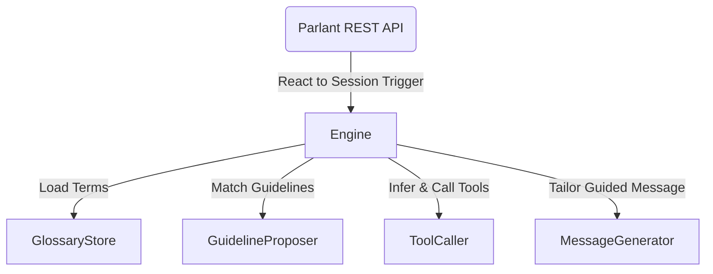
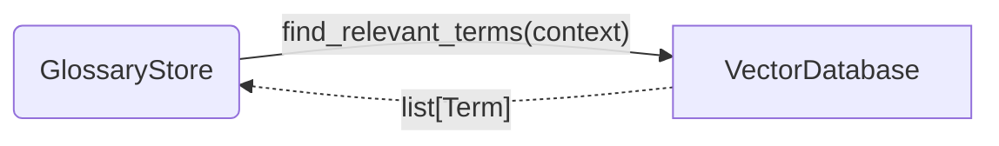
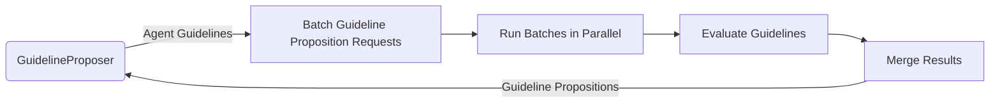
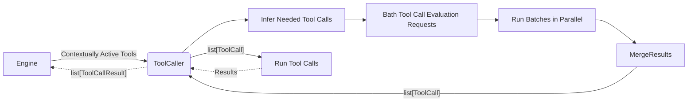
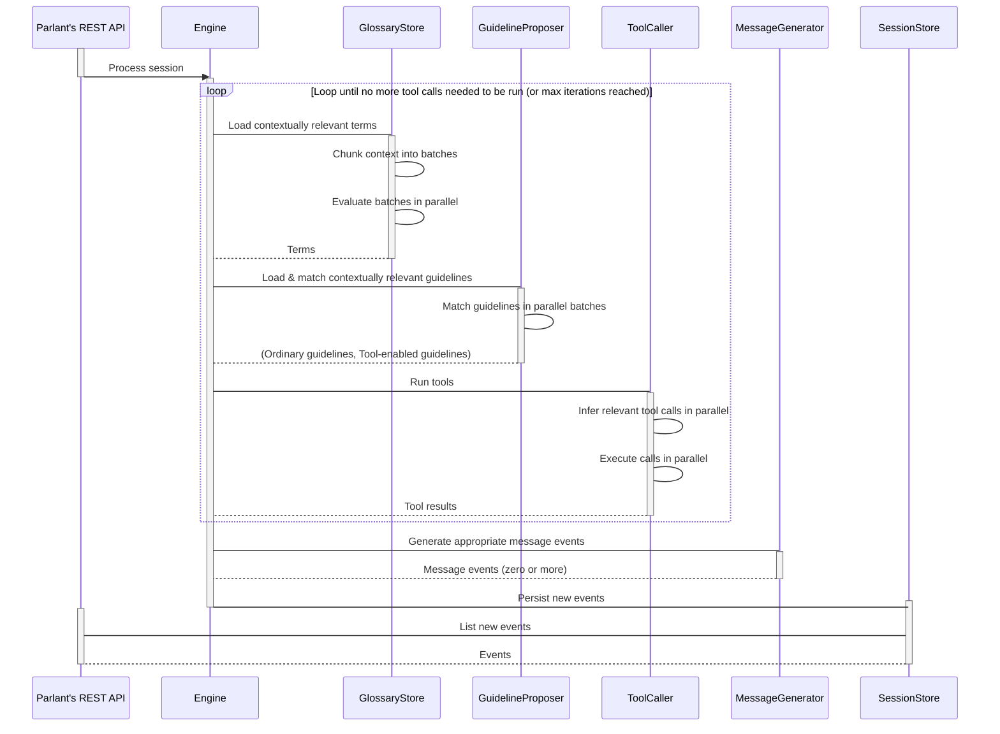

# Engine Lifecycle

In Parlant, the **Engine** is the part that's responsible for agent responses from end to end.

More specifically, since Parlant was designed from scratch with the thought of possibly having multiple engines for different use cases with different trade-offs, so far we've found that our initial engine is quite flexible. It is called the *Alpha Engine*, but since it is currently the only one, we will just refer to it as *The Engine*.

The engine is comprised of several components, each one dedicated to a particular mission. As we will see, each of these missions assists in creating a well-guided response, but at the same time is also quite complex in its own right.

While this document won't go into the specific components in detail, it will explain them briefly—just enough so that we can see how they interrelate and function together to produce a consistent responses.

## Main Components

There are currently 4 components to the engine, and more are being worked on as we speak, to support even more control and flexibility in the engine.

1. **Glossary Store**
2. **Guideline Proposer**
3. **Tool Caller**
4. **Message Generator**

Generally speaking, the Engine--normally activated by the API--uses all of these components when generating a response.

Each of these components acts as a part of the whole process of agent response. They are each designed to have a single responsibility in the process, and be independently optimizable, so that when something goes wrong we can know exactly which part of the process to turn to and optimize.

Let's briefly consider each of them in its own right.

### Glossary Store
This component allows us to store and retrieve relevant terms and definitions that are specific to our business domain.

These terms, or more correctly, the most relevant among them at each particular point in the conversation, are loaded into the execution context and made available to each of the other components. This not only allows the agent to respond in a way that's grounded to your domain's terminology, but also allows you to *define guidelines that themselves speak your terminology.*

In other words, the fetched glossary terms are imbued into all of the other components, to help them in accomplishing their task more accurately.

### Guideline Proposer
Before we explain what this component does, we first need to understand where it comes from.

As you probably already know, behavior in Parlant is controlled primarily using guidelines, where each guideline as a *condition* and an *action*. The condition is the part that specifies *when the action should be followed.*

Parlant takes advantage of this condition/action model to help the *Message Generator* stay focused, by only providing it with guidelines that are actually relevant for its current task. For example, if we have a guideline with the condition `the customer has just greeted you`, we do not need to account for the action of this guideline if we're well into the conversation at this point—it can just be disregarded. This helps improve accuracy, reduce the complexity of the guidance and supervision mechanism, and also lower the cost and latency of the LLM's completion.

The Guideline Proposer is what matches the appropriate guidelines that need to be activated in the generation of the agent's next response.

### Tool Caller
Instead of using vendor-provided tool-calling API, Parlant implements its own tool-calling mechanism.

There are three important reasons for this:
1. To support as many vendors as possible, including the ability to test other vendors and switch between them while maintaining the exact same user configuration.
1. To support **guided tool calling,** i.e. calling a tool in the context of a specific set of guidelines which explain not just the "what" and "how" of calling the tool, but also the "why" and "when".
1. To support multiple preparation iterations when working on a response; for example, where the first iteration matches relevant guidelines and runs tools and then, based on the output of the first iteration's tool calls, match a potentially different or wider set of guidelines, which may come with their own tool calls, and so forth. This allows you to specify guidelines freely and naturally, where their conditions can be met not just based on the conversation itself but also on data coming dynamically from tools. For more info on this, please refer to the [Optimization page](https://www.parlant.io/docs/advanced/optimization) on Parlant's docs site.

The ToolCaller receives a list of tools—all of the tools that are associated with the currently-matched guidelines—decides which need to be called and how, and runs them, returning the results to the engine.

### Message Generator
Finally we come to the component that actually generates the response message (potentially zero or more, to be exact, as the case demands).

Essentially, everything up until the Message Generator's turn is considered a *preparation* for the response—though this preparation may have already acted in the real world via tool calls. Yet, the customer doesn't know about it yet, because the agent still hasn't said anything about it.

The Message Generator is perhaps the most important component, where every other components basically aims to help it generate the most appropriate message possible.

It receives the relevant glossary terms, the matched guidelines for this particular state of the conversation, the tools that were just called, and the entire interaction history. Its job is to further evaluate the matched guidelines in-context, prioritize what the customer needs to hear first in the very next message, and ensure that the guidelines are adhered to as reliably as possible, while at the same time continuing the conversation with the customer as naturally as possible.

## Response Lifecycle

Now that we have a basic understanding of what each engine component does, let's look at the lifecycle of a single response. This diagram is somewhat simplistic in terms of the actual architecture, but it does capture the essence of what's happening.

The response cycle is designed to allow us to hook into it at various stages and control it with our own business logic (code), potentially replacing one of the components with our own implementation: say a fine-tuned SLM or an additional filter based on a BERT classifier.
